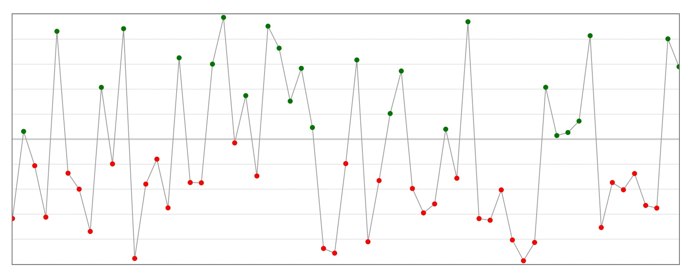

# AnimatedDataset

`AnimatedDataset` uses the power of [d3](https://d3js.org) [data join](https://github.com/d3/d3-selection#joining-data) to build solid animations.

Without animation you used to do something like:

```jsx
const dataset = [{ x: 10, y: 10 }, ... ]

return (
  <svg>
    {dataset.map(p => {
      const cx = p.x
      const cy = p.y

      return <circle key={p.y} cx={cx} cy={cy} r={4} />
    })}
  </svg>
)
```

This can be easly translated into this:

```jsx
import { AnimatedDataset } from 'react-animated-dataset'

// ...

const dataset = [{ x: 10, y: 10 }, ... ]

return (
  <svg>
    <AnimatedDataset
      dataset={dataset}
      tag="circle"
      attrs={{
        cx: p => p.x,
        cy: p => p.y,
        r: 4,
      }}
      keyFn={p => p.y}
    />
  </svg>
)
```

And it comes with animations too!

The component is designed to transform and animate dataset of any shape into any svg element. Animation are automatically triggered by passing a different `dataset`, a different `attrs` object or both. With `keyFn` the component is able to understand which datum has to be updated, added or removed.

## Install

```bash
yarn add react-animated-dataset
```

Note that, for this package to work, `react` and `d3` are also needed. If you haven't already installed them, install them with

```bash
yarn add react react-dom d3
```

More specifically, this package uses only `d3-selection` and `d3-transition` from the whole d3 ecosystem.

## Usage

The component creates a svg element (specified in `tag`) for each value of `dataset`. `tag` attributes are inferred from `attrs` object where _keys_ are the attribute name and _values_ can be the actual attribute value or a function that returns the value from a single dataset value (see example above).

When dataset values or attrs values change, `AnimatedDataset` triggers an animation to rearrange the data. The animation is indipendent for each dataset value and there can be 3 animation states:

- `enter`: datum is added
- `update`: datum value has changed
- `exit`: datum is removed

To tell one state from an other, `AnimatedDataset` uses `keyFn`: it is a function that should return an _unique_ value for each dataset entry. These animation states can be customized with the `init` prop. `init` has same shape as `attrs` and its values are used to specify the attributes values for every datum that is `enter`ing or `exit`ing the dataset.

```jsx
const lettersDataset = randomLetters()

<AnimatedDataset
  dataset={lettersDataset}
  tag="text"
  init={{
    opacity: 0,
    y: l => (lettersDataset.includes(l) ? 0 : 80),
  }}
  attrs={{
    opacity: 1,
    x: (_, index) => index * 40,
    y: 40,
    text: letter => letter,
    fill: 'black',
    fontSize: 50,
  }}
  keyFn={letter => letter}
/>
```

<p align="center">
  
</p>

In the example above, `opacity: 0` and `y` function in `init` are used for every entering and exiting letters.

### Use case: Linechart with d3

In this next example we will draw a simple line chart, with circles for each data point and a grid with only horizontal lines. Starting from a dataset of type `Array<{x: number, y: number}>`, we can use _d3.scaleLinear_ and _d3.line_ as a utility to map data points to coordinates and to create the shape of the path.

```jsx
// Initial setup

const xScale = d3
  .scaleLinear()
  .domain(xDomain)
  .range([0, WIDTH])

const yScale = d3
  .scaleLinear()
  .domain(yDomain)
  .range([HEIGHT, 0])

const lineGenerator = d3
  .line()
  .x(p => xScale(p.x))
  .y(p => yScale(p.y))


// To draw the horizontal grid we use yScale.ticks as dataset.
// To highlight the line relative to value 0 we can check tick
// value in 'stroke-width' and 'opacity'.

<AnimatedDataset
  dataset={yScale.ticks(10)}
  tag="line"
  init={{ opacity: 0 }}
  attrs={{
    x1: xScale.range()[0],
    x2: xScale.range()[1],
    y1: tick => yScale(tick),
    y2: tick => yScale(tick),
    stroke: 'lightgrey',
    strokeWidth: tick => (tick === 0 ? 2 : 1),
    opacity: tick => (tick === 0 ? 1 : 0.5),
  }}
  keyFn={tick => tick}
/>


// Next we draw the linechart using a single path. To get a single
// path out of AnimatadDataset we need to wrap our dataset in
// an array and set d attribute to the lineGenerator.

<AnimatedDataset
  dataset={[dataset]}
  tag="path"
  attrs={{
    d: lineGenerator,
    fill: "none",
    stroke: "darkgrey"
  }}
  keyFn={(_, i) => i}
/>


// Finally we add circles for every data point. As for
// grid, we use xScale and yScale to calculate the actual
// position. We can also change fill according to y value.

<AnimatedDataset
  dataset={dataset}
  tag="circle"
  attrs={{
    opacity: 1,
    cx: p => xScale(p.x),
    cy: p => yScale(p.y),
    fill: p => (p.y >= 0 ? "green" : "red"),
    r: 3
  }}
  keyFn={(_, i) => i}
/>
```

<p align="center">
  
</p>

Whenever `dataset`, `xRange` or `yRange` change, we have smooth animations.

<p align="center">
  
</p>

As it can be seen in the result, `AnimatedDataset` supports _path morphing_ and _color interpolation_. Also, thanks to the combination of grid `keyFn` and `init` props, the component knows which line to move and which to fade in/out.

## Props

<h3 id="dataset">
  <a  href="#dataset">#</a> dataset
</h3>

- **Required**
- Type: `Array<any>`

<h3 id="attrs">
  <a  href="#attrs">#</a> attrs
</h3>

- **Required**
- Type: `{[key: string]: number | string | ((datum: any, index: number, nodes: Array<SVGElement>) => number | string)}`

`attrs` keys should be an attribute name for given `tag`. They can be kebab-case (`stroke-width`) or camel case (`strokeWidth`).

`attrs` values should be the actual value or a function to calculate the value. Function accepts as parameter a single datum, its index and the array of rendered svg elements (the d3 selection).

```jsx
<AnimatedDataset
  attrs={{
    stroke: 'black',
    strokeWidth: datum => datum.someValue * 10,
    'font-size': 15,
    fill: (datum, index, nodes) => ...
  }}
/>
```

<h3 id="events">
  <a  href="#events">#</a> events
</h3>

- Type: `{ [key: string]: (mouseEvent: MouseEvent, datum: any) => void }`

Event listeners keys can be written in kebab-case (`on-mouseover`) or camel case (`onMouseOver`).

```jsx
<AnimatedDataset
  events={{
    'on-click': (mouseEvent, datum) => console.log(datum),
    onMouseOver: (mouseEvent, datum) => ...
  }}
/>
```

<h3 id="tag">
  <a  href="#tag">#</a> tag
</h3>

- Type: `string`
- Default: `"rect"`

Any valid svg tag name.

<h3 id="keyFn">
  <a  href="#keyFn">#</a> keyFn
</h3>

- Type: `(datum: any, index: number, nodes: Array<SVGElement>) => any`
- Default: `datum => datum.key`

A function that identifies dataset values. It should return an unique value for each datum.

<h3 id="init">
  <a  href="#init">#</a> init
</h3>

- Type: `{[key: string]: number | string | ((datum: any, index: number, nodes: Array<SVGElement>) => number | string)}`

Same as [attrs](#-attrs). `init` values are used to animate entering and exiting values. It doesn't support event listeners.

<h3 id="disableAnimation">
  <a  href="#disableAnimation">#</a> disableAnimation
</h3>

- Type: `boolean`
- Default: `false`

If `true` animation is disabled and the data is updated immediately.

<h3 id="duration">
  <a  href="#duration">#</a> duration
</h3>

- Type: `number | (datum: any, index: number , nodes: Array<SVGElement>) => number`
- Default: `1000`

The animation duration in milliseconds.

<h3 id="delay">
  <a  href="#delay">#</a> delay
</h3>

- Type: `number | (datum: any, index: number , nodes: Array<SVGElement>) => number`
- Default: `0`

The animation delay in milliseconds.

<h3 id="durationByAttr">
  <a  href="#durationByAttr">#</a> durationByAttr
</h3>

- Type: `{[key: string]: number | ((datum: any, index: number, nodes: Array<SVGElement>) => number)}`

If defined, allows to specify a different animation duration for each attribute

<h3 id="delayByAttr">
  <a  href="#delayByAttr">#</a> delayByAttr
</h3>

- Type: `{[key: string]: number | ((datum: any, index: number, nodes: Array<SVGElement>) => number)}`

If defined, allows to specify a different animation delay for each attribute

<h3 id="easingByAttr">
  <a  href="#easingByAttr">#</a> easingByAttr
</h3>

- Type: `{[key: string]: number | ((datum: any, index: number, nodes: Array<SVGElement>) => number)}`

If defined, allows to specify a different animation easing for each attribute

<h3 id="children">
  <a  href="#children">#</a> children
</h3>

- Type: Any Valid React Node

If defined, the child node(s) will be created for each entry in dataset, allowing for complex nesting hierarchies of react-animated-dataset

## Contributing

If you make some edits and wish to test them locally you can run `yarn test`.

To publish run `yarn release`.
